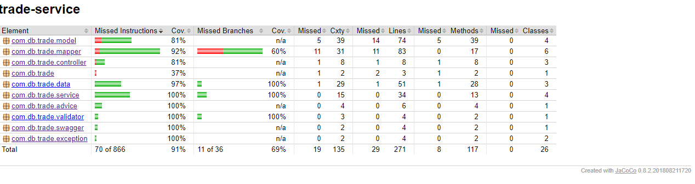

# trade-service
   Springboot based Trade service. Handles Trade creation and updation. If the lower version is being received by the store it will reject and throw StaleTradeException. If trade has less maturity date then today date then it will return Maturity date in past using TradeExpiredException. Book data and CounterParty data is cached using Spring @Cachable anotation.

**Build Steps**

mvn clean install

**Run Steps**

java -jar target/trade-service-0.0.1-SNAPSHOT.jar
java -Dspring.profiles.active=dev -jar target/trade-service-0.0.1-SNAPSHOT.jar
java -Dspring.profiles.active=qa -jar target/trade-service-0.0.1-SNAPSHOT.jar
java -Dspring.profiles.active=prod -jar target/trade-service-0.0.1-SNAPSHOT.jar

# The System Design

  
   

**Eception Handling**

  
   

**Swagger UI**
http://localhost:8081/trade-service/swagger-ui.html

  
   

How to test :-
 1) http://localhost:8081/trade-service/swagger-ui.html
 2) get the counter party if from counter-party-controller service in swagger ui
 3) get the book id from trade-book-controller service in swagger ui
 4) Now submit trade using above ids in trade-conroller service

**Swagger Document**

http://localhost:8081/trade-service/v2/api-docs

**Code Coverage**

  
   

**Swagger Document**

http://localhost:8081/trade-service/v2/api-docs

**Test Result**

  
   

